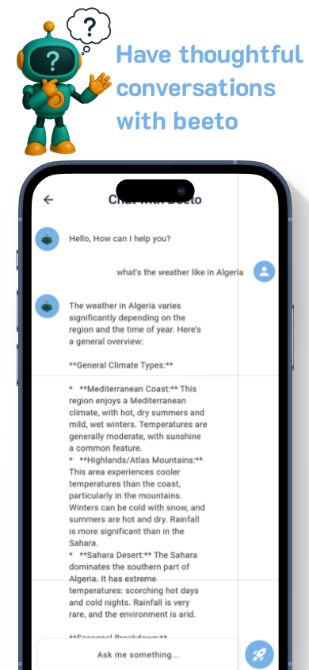

# Beeto - AI Assitant

A modern AI assistant app built with Flutter and GetX, featuring chat, drawing, and translation capabilities with support for state management, responsive UI, and smooth user interaction.

## Screenshots

<div align="center">
  
  
  
  
  
  
  
</div>

## Features

- Chat with Beeto to get instant answers, ideas, or friendly conversation
- Draw with Beeto using simple prompts to turn imagination into visuals
- Translate text in real time across multiple languages
- Seamless onboarding with intuitive screens
- Dark/Light theme support for better user experience
- Modern and minimal UI for easy navigation 
- Error handling for smooth user experience (e.g., no results found, connection issues)

## Setup

1. Clone the repository
2. Install dependencies:
   ```bash
   flutter pub get
   ```
3. Create a `.env` file in the root directory and add your AI API key from https://aistudio.google.com/:
   ```
   GEMINI_API_KEY = your_api_key_here
   ```
4. Run the app:
   ```bash
   flutter run
   ```

## Dependencies

- google_generative_ai: ^0.4.3 – Google Gemini AI integration for generating text, images, and more
- get: ^4.6.6 – State management, routing, and dependency injection
- flutter_animate: ^4.5.0 – Easy-to-use animation toolkit for custom transitions and effects
- animated_text_kit: ^4.2.2 – Animated text widgets for engaging UI elements
- http: ^1.2.2 – Simple and powerful HTTP client for REST API calls
- translator_plus: ^1.0.1 – Google-powered language translation for multilingual support
- image_gallery_saver: ^2.0.3 – Save images directly to the device gallery
- flutter_dotenv: ^5.2.1 – Load environment variables securely from .env files
- iconsax: ^0.0.8 – Clean and modern icon pack for Flutter apps
- get_storage: ^2.1.1 – Lightweight and fast local key-value storage


## Project Structure

```
lib/
├── api/ - api logic
├── const/ - For constant Strings and enums
├── controllers/ - Business logic and state management
├── helper/ - Helper functions and utilities
├── model/ - class models
├── routes/ - Navigation and routing configuration
├── screens/ - App screens
├── theme/ - App theming and styling
├── widget/ - UI components
├── main.dart - Application entry point
└── my_app.dart - Root widget configuration
```

## Getting an API Key

1. Go to [Gemini api](https://aistudio.google.com/)
2. Sign up for a free account
3. Apply for a API key
4. Add it to the `.env` file

## License

MIT License
